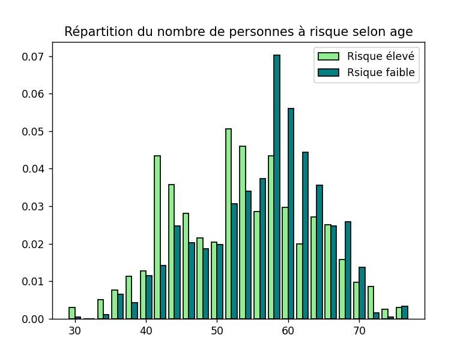
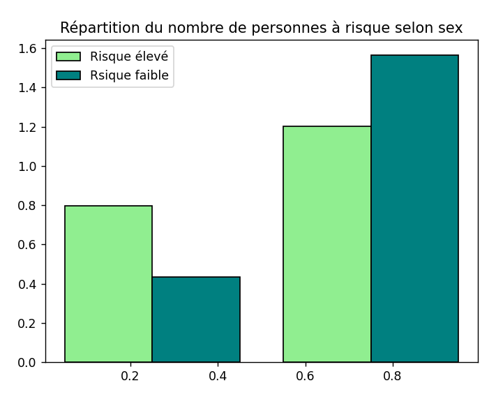
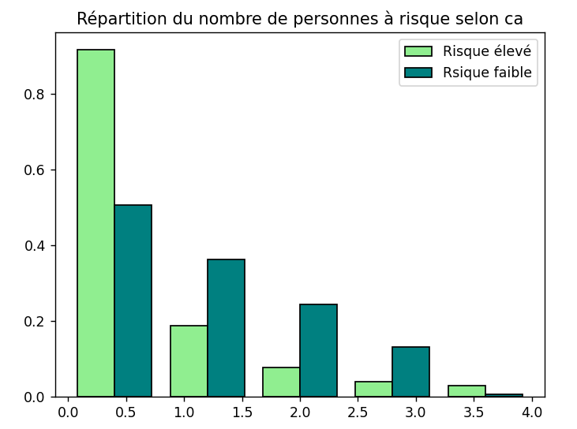
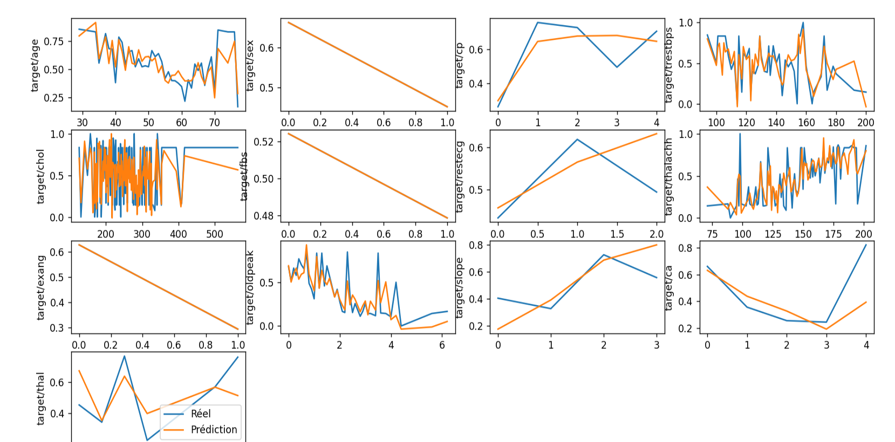

# **Projet DATA731 - Heart Disease Prediction Dataset**

*Par : Charlotte Chanudet, Louna Camas et Mathieu Docher*

*Données utilisées : [Heart Disease Prediction Dataset - Kaggle](https://www.kaggle.com/datasets/mfarhaannazirkhan/heart-dataset)* 

---

## Introduction - Présentation du dataset

Le dataset choisi pour ce projet recense des patients ainsi que leurs risques d'attaque cardiaque ainsi que plusieurs caractéristiques les concerant.
 
 **Explications des différentes caractéristiques**

1. `age:` est l'age des patients

2. `sexe:` est le sexe du patient (_1 = homme et 0 = femme_)

3. `cp:` est le type de douleur thorasique ressentie par le patient 
 (_Valeurs possible :0 = angine de pointrine typique, 1 = angine de pointrine atypique, 2 = douleur de pointrine non spécifié , 3 = Asympthomatique_)
 L'**angine de poitrine**, ou **angor**, désigne une douleur thoracique qui apparaît généralement pendant un effort ou un stress.

4. `ntrestbps:` est la pression sangine en mmhg (_en mmHg_)

5. `chol`: est le niveau de choléstérol (_en mg/dl_)

6. `fbs` est le taux de sucre a jeun, il doit etre en dessous de 120mg/dl (_1 = Vrai, 0 = Faux_)

7. `restecg:` est le resultat des electrocardigramme au repos (_0 = Normale, 1 = anomalie du segement ST-T, 2 = hypertrophie du ventriculaire gauche_)

8. `thalach:` est la fréquence cardiaque maximum atteinte (_en bpm_)

9. `exang:` est l'angor induit par l'effort (_1 = oui, 0 = non_)

10. `oldpeak:` est le baisse du segment ST induit par l'effort par rapport au repos

11. `slope:` est la point du segement ST en execice _(0 = ascendante, 1 = plat, 2 = decendante_)

12. `ca:` nombre de artere majeur coloré par fluoroscopy(_0, 1, 2, 3_)

13.`thal:` types de thalassémie (_1 = Normale, 2 = defaut definitif , 3 = default reversible_)

14. `target:` reslutat des risque d'attaque cardiaque (_1 = plus de chance d'attaque cardiaque 0 = moins de chance d'attaque cardiaque_)

Les bibliothèques python utilisées pour ce projet sont les suivantes : 
- <u>pandas</u> (as pd) : pour la manipulation des données
- <u>numpy</u> (as np) : pour les calculs mathématiques
- <u>matplotlib.pyplot</u> (as plt) : pour les graphiques
- <u>seaborn</u> (as sns) : pour les graphiques plus élaborés
- <u>sklearn</u> : pour les modèles prédictifs 

---

## Histogrammes 

Pour commencer, on a essayé de visualiser les données en utilisant des histogrammes. 

Grace à cela, on peut avoir une première idée de la distribution des malades selon différentes caractéristiques.

Pour générer les histogrammes selon une variable particulière, on utilise la fonction suivante : 

```python
def repartitionParCaractere(data1, data2, feature, nb_barres):
    count, bins, ignored = plt.hist(
        [data1[feature],data2[feature]],
        nb_barres,
        histtype="bar", 
        color=['lightgreen','teal'],
        edgecolor='black', 
        density=True, 
        label=["Risque élevé", "Rsique faible"]
    )
    plt.legend(prop={'size': 10})
    plt.title(f"Répartition du nombre de personnes à risque selon {feature}")
    plt.show()
```

On obtient les histogrammes suivants (ici uniquement pour les variables `age`, `sex` et `ca`) :

 



---

## Matrice de corrélation

**Définition :**
Une matrice de corrélation permet de visualiser les corrélations (c'est-à-dire la dépendance linéaire) entre les différentes variables d'un jeu de données. Elle est souvent utilisée pour <u>déterminer les variables les plus importantes</u> pour prédire une variable cible. 

Chaque cellule de la matrice contient un coefficient qui varie entre -1 et 1. Plus le coefficient est proche de 1, plus les deux variables sont corrélées positivement. Plus le coefficient est proche de -1, plus les deux variables sont corrélées négativement. Un coefficient proche de 0 signifie qu'il y a peu de corrélation entre les deux variables.

La valeur de la cellule (i, j) est égale à $r_{i,j} = \bold{\frac{cov(X_i, X_j)}{\sigma_{X_i} \sigma_{X_j}}}$ où $cov(X_i, X_j)$ est la covariance entre les variables $X_i$ et $X_j$ et $\sigma_{X_i}$ et $\sigma_{X_j}$ sont les écarts-types de $X_i$ et $X_j$.

Pour générer la matrice de correlation, on utilise la fonction suivante : 

```python
def matriceCorrelation(data):
    numeric_df = data.select_dtypes(include=[np.number])
    df_corr=numeric_df.corr()
    
    plt.figure(figsize=(12, 8))
    sns.heatmap(df_corr,annot=True, cmap="magma")
    plt.title("Matrice de corréralation")
    plt.show()
```

On obtient la matrice de correlation suivante : 


On remarque que la variable cible `target` est fortement corrélée positivement avec les variables `cp`, `thalach`, `slope` et `restecg`. Elle est fortement corrélée négativement avec les variables `exang`, `oldpeak` et `ca`.

Plus la correlation est élevée <u>en valeur absolue</u>, plus la variable est importante pour prédire la variable cible.

---

## Entropies

### Entropie

**Définition** : Une entropie est une mesure de l'incertitude d'une variable aléatoire. Plus l'entropie est élevée pour un attribut, plus il y a de diversité dans la colonne, ce qui indique qu'elle couvre une large gamme de catégories. Une entropie faible, au contraire, montre que la colonne est plus homogène (dominée par une ou deux catégories).
L'entropie epsilon est calculée avec $H(X) = - \sum_{i=1}^{n} p(x_i) \log p(x_i)$ où $p(x_i)$ est la probabilité de la valeur $x_i$ dans la colonne.


### Entropie Conditionnelle

**Définition** : L'entropie conditionnelle est une mesure de l'incertitude d'une variable aléatoire, <u>sachant une autre variable aléatoire</u>. Elle est utilisée pour mesurer la quantité d'information nécessaire pour décrire la sortie d'un système, sachant l'entrée.
Plus l'entropie conditionnelle d'une variable est élevée, plus il faut apporter d'informations supplémentaire pour prédire la variable cible. Plus elle est faible, plus la variable est importante pour prédire la variable cible.
L'entropie conditionnelle est calculée avec $H(Y|X) = - \sum_{i=1}^{n} p(x_i) \sum_{j=1}^{m} p(y_j|x_i) \log p(y_j|x_i)$ où $p(y_j|x_i)$ est la probabilité de la valeur $y_j$ sachant la valeur $x_i$ dans la colonne.


---

## Modèles prédictifs

Pour prédire la variable cible `target`, on a utilisé un modèle regressif (et un arbre de décision) :

### 1. Calcul des coefficients :

- On a utilisé un modèle de régression pour prédire la variable cible `target` en fonction des autres variables.
- On a utilisé la fonction suivante pour générer le modèle : 

```python
def calcul_coefficients(df):
    """
    Calcul des coefficients de la régression linéaire et de l'arbre de décision pour prédire la cible
    Input : 
        - df, le dataframe contenant les données
    Output : 
        - regression, l'objet de régression linéaire,
        - decision_tree, l'objet de l'arbre de décision
    """
    # Séparation des variables et de la cible
    variables, results = serparer_variables_cible(df)

    # Régression linéaire
    regression = linear_model.LinearRegression()
    regression.fit(variables, results)

    # Arbre de décision
    decision_tree = tree.DecisionTreeClassifier()
    decision_tree.fit(variables, results)

    return regression, decision_tree
```

- On obtient les coefficients suivants :

```
    variable  coefficient
0        age    -0.001046
1        sex    -0.146262
2         cp     0.091528
3   trestbps    -0.001005
4       chol    -0.000419
5        fbs     0.007251
6    restecg     0.035307
7   thalachh     0.001545
8      exang    -0.115519
9    oldpeak    -0.030532
10     slope     0.172099
11        ca    -0.075477
12      thal    -0.042790
```

- On obtient également un arbre de décision qui permet de prédire la variable cible

### 2. Prédiction de la variable cible pour une personne

- On a utilisé la fonction suivante pour prédire la variable cible pour une personne donnée : 

```python
def predire_cible(person, regression=None, decision_tree=None):
    """
    Prédiction de la cible pour une personne
    Input : 
        - person, les données de la personne
        - regression, l'objet de régression linéaire,
        - decision_tree, l'objet de l'arbre de décision
    Output : 
        - la prédiction de la cible pour la personne
    """
    if regression is None and decision_tree is None:
        print("Erreur : regression et decision_tree ne peuvent pas être tous les deux nuls")
    elif regression is None:
        print(f"Prédiction de la cible pour la personne : {decision_tree.predict(person)[0]}")
    elif decision_tree is None: 
        print(f"Prédiction de la cible pour la personne : {regression.predict(person)[0]}")
    else:
        print(f"Prédiction de la cible pour la personne : {regression.predict(person)[0]}, {decision_tree.predict(person)[0]}")
```

- Soit la personne suivante :

```python
person = pd.DataFrame({
    'age':22,
    'sex':0,
    'cp':0,
    'trestbps':140,
    'chol':200,
    'fbs':1,
    'restecg':0,
    'thalachh':200,
    'exang':0,
    'oldpeak':0,
    'slope':1,
    'ca':2,
    'thal':1
}, index=[0])
```

- On obtient la prédiction suivante : 

```
Prédiction de la cible pour la personne : 0.5826130070328832, 0
```

Selon le modèle regressif, la personne a 58% de chance d'avoir une attaque cardiaque. Selon l'arbre de décision, la personne n'a pas de risque d'attaque cardiaque.
Ici les deux modèles ne sont pas d'accord car les valeurs des caractéristiques de la personne ont été choisies exprès, mais en général, les deux modèles donnent le même résultat.

### 3. Comparaison des prédictions avec la réalité

- On a utilisé la fonction suivante pour comparer les prédictions avec la réalité : 

```python
def graph_prediction_pour_chaque_cle(keys, regression, df):
    """
    Comparaison des prédictions et de la réalité pour chaque clé
    Input : 
        - keys, les clés à comparer
        - regression, l'objet de régression linéaire,
        - df, le dataframe contenant les données
    """
    # Fonction pour générer un subplot pour chaque clé
    def comparer_predictions_realité(key):
        grouped = df.groupby(key).mean()
        plt.plot(grouped.index, grouped['target'])

        # Création d'un dataframe avec toutes les valeurs prédites pour chaque valeur de la clé
        df_predictions = get_prediction_dataframe(df, regression)
        grouped_predictions = df_predictions.groupby(key).mean()
        plt.plot(grouped_predictions.index, grouped_predictions['prediction'])  
        plt.ylabel(f'target/{key}')

    # Affichage du graphique
    plt.figure(figsize=(20, 20))
    for i, key in enumerate(keys):
        plt.subplot(4, 4, i+1)
        comparer_predictions_realité(key)
    plt.legend(['Réel', 'Prédiction'])
    plt.show()
```

- On obtient les graphiques suivants :



On remarque que les prédictions sont assez proches de la réalité mais pour les variables "binaires" (comme `sex` ou `fbs`), les prédictions sont exactements les mêmes que la réalité, ce qui est normal mais ne donne aucune information.

---

## Critique du dataset

- **Points positifs** : 
    - Les données sont assez complètes et permettent de prédire la variable cible avec une bonne précision.
    - Les données sont propres et ne nécessitent pas de nettoyage particulier.

- **Points négatifs** :
    - Les données ne sont pas fiables.
    En effet, on remarque que le risque cardiaque diminue avec l'age de la personne. Cela est peu probable dans la réalité.
    La raison derrière cela est que les personnes plus jeunes ne se font tester que si elles ont des symptomes, alors que les personnes plus agées se font tester régulièrement.
    Il y a donc un plus grand pourcentage de tests négatifs chez les personnes plus agées que chez les personnes plus jeunes. 
    C'est pour cette raison que la correlation entre l'age et le risque cardiaque est négative dans la matrice de correlation, alors que dans la réalité, c'est censé être assez correlé.
