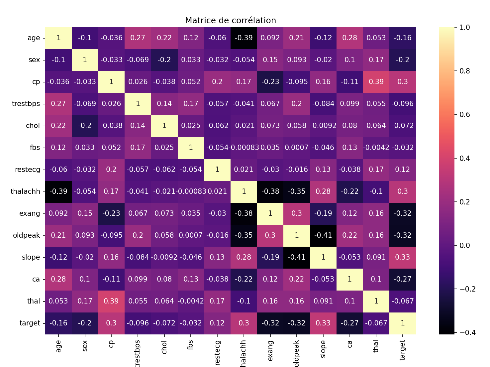

# **Projet DATA731 - Heart Disease Prediction Dataset**

*Par : Charlotte Chanudet, Louna Camas et Mathieu Docher*

*Données utilisées : [Heart Disease Prediction Dataset - Kaggle](https://www.kaggle.com/datasets/mfarhaannazirkhan/heart-dataset)* 

---

## Introduction - Présentation du dataset


Les bibliothèques python utilisées pour ce projet sont les suivantes : 
- <u>pandas</u> (as pd) : pour la manipulation des données
- <u>numpy</u> (as np) : pour les calculs mathématiques
- <u>matplotlib.pyplot</u> (as plt) : pour les graphiques
- <u>seaborn</u> (as sns) : pour les graphiques plus élaborés
- <u>sklearn</u> : pour les modèles prédictifs 

---

## Histogrammes 

Pour commencer, on a essayé de visualiser les données en utilisant des histogrammes. 

Grace à cela, on peut avoir une première idée de la distribution des malades selon différentes caractéristiques.

Pour générer les histogrammes selon une variable particulière, on utilise la fonction suivante : 

```python
def repartitionParCaractere(data1, data2, feature, nb_barres):
    count, bins, ignored = plt.hist(
        [data1[feature],data2[feature]],
        nb_barres,
        histtype="bar", 
        color=['lightgreen','teal'],
        edgecolor='black', 
        density=True, 
        label=["Risque élevé", "Rsique faible"]
    )
    plt.legend(prop={'size': 10})
    plt.title(f"Répartition du nombre de personnes à risque selon {feature}")
    plt.show()
```


---

## Matrice de corrélation

**Définition :**
Une matrice de corrélation permet de visualiser les corrélations (c'est-à-dire la dépendance linéaire) entre les différentes variables d'un jeu de données. Elle est souvent utilisée pour <u>déterminer les variables les plus importantes</u> pour prédire une variable cible. 

Chaque cellule de la matrice contient un coefficient qui varie entre -1 et 1. Plus le coefficient est proche de 1, plus les deux variables sont corrélées positivement. Plus le coefficient est proche de -1, plus les deux variables sont corrélées négativement. Un coefficient proche de 0 signifie qu'il y a peu de corrélation entre les deux variables.

La valeur de la cellule (i, j) est égale à $r_{i,j} = \bold{\frac{cov(X_i, X_j)}{\sigma_{X_i} \sigma_{X_j}}}$ où $cov(X_i, X_j)$ est la covariance entre les variables $X_i$ et $X_j$ et $\sigma_{X_i}$ et $\sigma_{X_j}$ sont les écarts-types de $X_i$ et $X_j$.

Pour générer la matrice de correlation, on utilise la fonction suivante : 

```python
def matriceCorrelation(data):
    numeric_df = data.select_dtypes(include=[np.number])
    df_corr=numeric_df.corr()
    
    plt.figure(figsize=(12, 8))
    sns.heatmap(df_corr,annot=True, cmap="magma")
    plt.title("Matrice de corréralation")
    plt.show()
```

On obtient la matrice de correlation suivante : 



On remarque que la variable cible `target` est fortement corrélée positivement avec les variables `cp`, `thalach`, `slope` et `restecg`. Elle est fortement corrélée négativement avec les variables `exang`, `oldpeak` et `ca`.

Plus la correlation est élevée <u>en valeur absolue</u>, plus la variable est importante pour prédire la variable cible.

---


